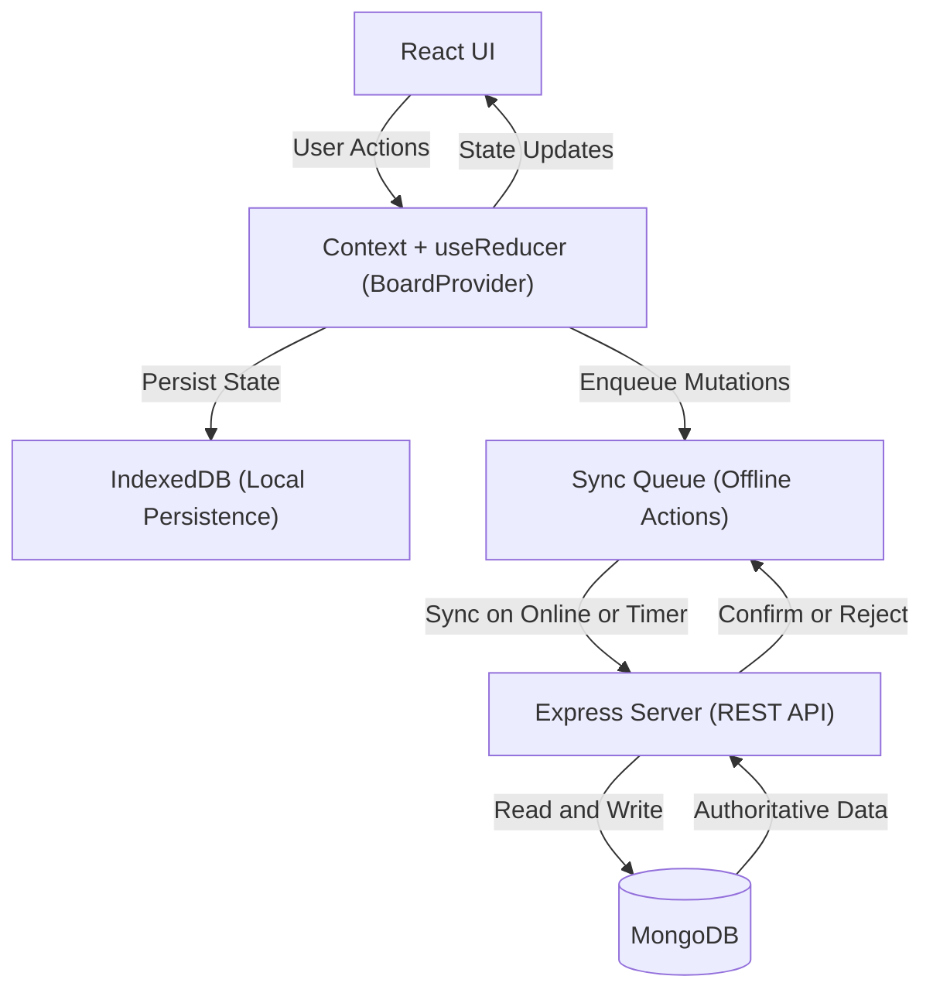

# High level architecture
## High level diagram:

## High level architecture
- ### UI communicates with states and context to rerender components
- ### State changes invoke indexedDB changes (local storage) 
- ### State changes invoke a change that gets added to a queue that gets handled by the server
- ### Express server stores changes to a Mongo Database 
- ### Upon connection to express server, server loads changes and compares it to the indexedDB and invokes a conflict which the user changes how to handle 
---
